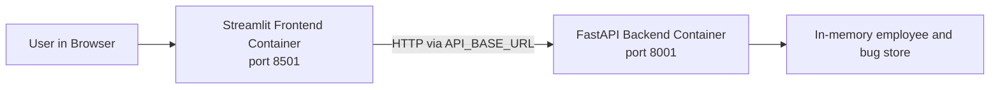

# fastapiclassrepo

This project uses [uv](https://docs.astral.sh/uv/) for Python dependency and environment management.

## Application purpose

This repository is a small multi-tier bug and employee management application used to demonstrate how a frontend UI, a backend API, and container-based deployment work together.

The application lets users:

- view, create, update, and delete employees
- view, create, update, and delete bugs
- connect a user-facing frontend to a backend API through HTTP calls
- package each tier into separate containers for repeatable local and cloud deployment

## Overall deployment architecture

The solution is split into two runtime tiers:

- Frontend tier: a Streamlit web application that provides the user interface
- Backend tier: a FastAPI application that exposes REST endpoints for employee and bug management

The frontend does not access data directly. It sends HTTP requests to the backend API, and the backend handles validation, business rules, and in-memory data operations.



For containerized local development, Docker Compose creates a private network so the frontend container can call the backend container by service name.

## Multi-tier application layers

### Frontend layer

The frontend is implemented in [bug_frontendui.py](/Users/narendranasokaraju/DBB/Class/2026_midc/FastApiClassCode/fastapiclassrepo/bug_frontendui.py). It provides:

- an employee management tab
- a bug management tab
- forms for create, update, and delete operations
- API integration through the `API_BASE_URL` environment variable

This layer is responsible for user interaction and presentation only.

### Backend API layer

The backend entrypoint is [bug_employee_api.py](/Users/narendranasokaraju/DBB/Class/2026_midc/FastApiClassCode/fastapiclassrepo/bug_employee_api.py). It combines the employee and bug routes into a single FastAPI service.

The API layer is responsible for:

- receiving requests from the frontend
- validating request payloads
- exposing REST endpoints such as `/employees` and `/bugs`
- returning structured JSON responses

The current data models and in-memory store are defined in [bug_employee_store.py](/Users/narendranasokaraju/DBB/Class/2026_midc/FastApiClassCode/fastapiclassrepo/bug_employee_store.py).

### Container layer

Each application tier is packaged independently:

- [Dockerfile.bug-frontend](/Users/narendranasokaraju/DBB/Class/2026_midc/FastApiClassCode/fastapiclassrepo/Dockerfile.bug-frontend) builds the Streamlit frontend container
- [Dockerfile.bug-api](/Users/narendranasokaraju/DBB/Class/2026_midc/FastApiClassCode/fastapiclassrepo/Dockerfile.bug-api) builds the FastAPI backend container

This separation is useful because each tier can be:

- built independently
- versioned independently
- deployed independently
- scaled independently in a cloud environment

## Docker and Docker Compose

### Docker

Docker is used to package the application and its runtime dependencies into images. In this project, Docker provides:

- a consistent Python runtime
- isolated execution for frontend and backend tiers
- portable images that can run locally or in a cloud registry such as Azure Container Registry

Each Dockerfile installs dependencies from `pyproject.toml` and `uv.lock`, copies the application code, exposes the required port, and defines the startup command.

### Docker Compose

Docker Compose is used to run the two containers together as one application stack. The configuration is defined in [docker-compose.yml](/Users/narendranasokaraju/DBB/Class/2026_midc/FastApiClassCode/fastapiclassrepo/docker-compose.yml).

Compose handles:

- building both images from the correct Dockerfiles
- starting the backend API container
- starting the frontend container
- wiring container-to-container communication
- publishing ports to the host machine

In this setup:

- `bug-employee-api` runs on port `8001`
- `bug-frontend-ui` runs on port `8501`
- the frontend reaches the backend using `http://bug-employee-api:8001`

## Deployment flow

The deployment flow for this project is typically:

1. Build the backend and frontend images with Docker.
2. Run both services locally with Docker Compose.
3. Push the images to a container registry such as Azure Container Registry.
4. Deploy the images to a container host or orchestration platform.

This keeps the same application structure across local development, testing, and cloud deployment.

## Quick start

1. Sync the environment:

   uv sync

2. Activate the virtual environment (PowerShell):

   .\.venv\Scripts\Activate.ps1

## Dependency management

- Add a runtime dependency:

  uv add <package>

- Add a development dependency:

  uv add --dev <package>

- Remove a dependency:

  uv remove <package>

- Recreate lockfile after edits:

  uv lock

## Run commands in project environment

Use `uv run` to execute commands using the project environment without manually activating it.

Examples:

- uv run python --version
- uv run pytest

## Run with Docker Compose

Build and start the multi-container application:

```bash
docker compose up --build
```

After startup:

- frontend UI: `http://localhost:8501`
- backend API: `http://localhost:8001`
